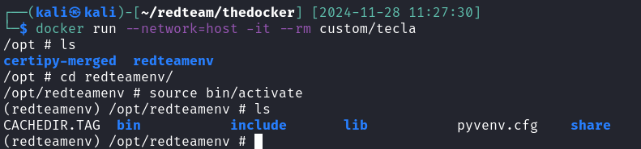
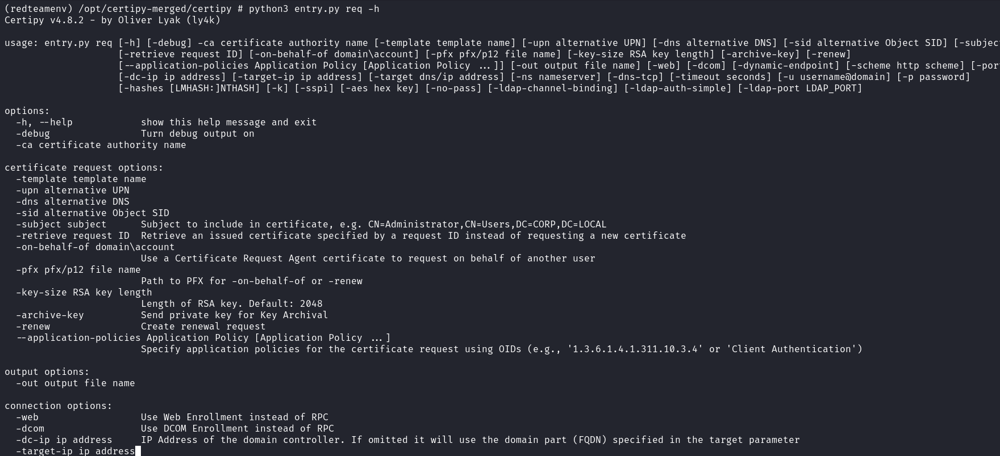
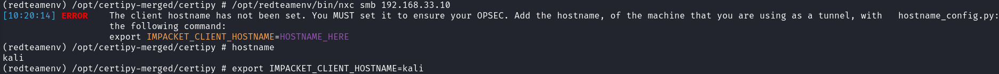

# Docker
Contenedor de docker que contiene las tools de impacket, netexec y certipy en virtual environment de python para reforzar el OPSEC.

## Uso
1. Descargar [docker](https://www.digitalocean.com/community/tutorials/how-to-install-and-use-docker-on-ubuntu-22-04)
2. Ve a Telegram y descarga ```tecla.7z```
3. Cargar el contenedor de docker en la máquina:

```
$ docker load < tecla.tar
```
4. Ejecutar el contenedor:

```
$ docker run --network=host -it --rm custom/tecla
```

5. Acceder al virtualenv

```
$ source redteamenv/bin/activate
```




6. Las herramientas se encuentran en las siguientes rutas:
```
$ /opt/impacket-master/examples/*.py 
$ /opt/redteamenv/bin/nxc
$ python3 /opt/certipy-merged/certipy/entry.py
```




[!IMPORTANT]
Para el uso de netexec hay que asignar la variable IMPACKET_CLIENT_HOSTNAME con el hostname a utilizar.
```
export IMPACKET_CLIENT_HOSTNAME=HOSTNAME_HERE
```

